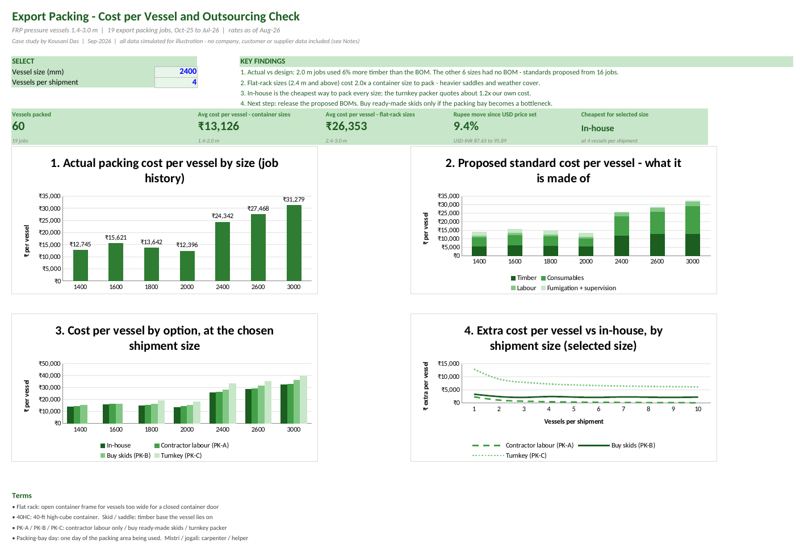
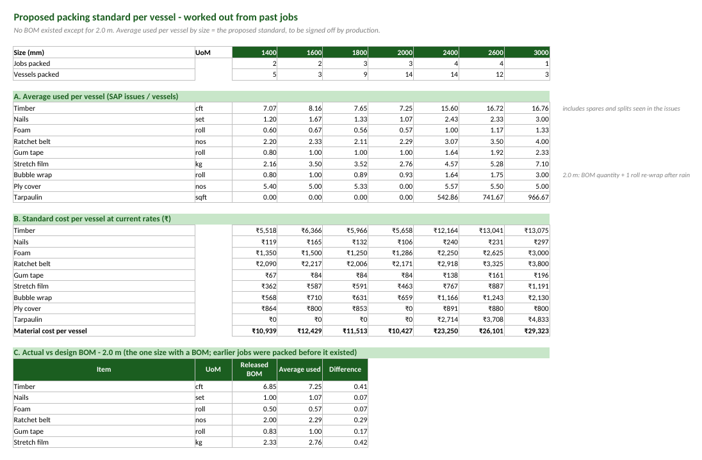

# Export Packing Cost Analysis — In-house vs Outsourced (Excel case study)

An Excel model that costs export packing for FRP pressure vessels from SAP-style stores data, proposes standard packing BOMs for the sizes that had none, and checks whether outsourcing packing would be cheaper than doing it in-house.

> **Data note:** this is a fictional case study. All data — orders, SAP stores issues, labour log, BOM and vendor quotes — is simulated to mirror the structure of real SAP exports and shop records. No company, customer or supplier data is included. Material rates, wages and USD-INR are anchored to public market data (links inside the workbook).

## The problem

Management set two goals: **close the gap between actual and design BOMs**, and **decide which outsourced activities should be done in-house**. For export packing (timber skids, foam, bubble wrap, stretch film, lashing), only one vessel size (2.0 m) had a written packing BOM. Every other size was packed as the supervisor decided, so nobody knew what packing actually cost per vessel.

Three questions:
1. What does packing cost per vessel, by size?
2. What standard BOM should each size have?
3. Is any outsourcing option cheaper than packing in-house?

## My role

Engineering inputs (packing method, vessel dimensions, what a BOM should contain) came from the project engineer. **I did the data work:** collecting the SAP exports, labour log and vendor rates, cleaning them, building the costing model, the analysis and the dashboard.

## Approach

1. **Collected** SAP goods-issue exports, a packing labour log, vendor rates and three packer quotes (`Data -` tabs, pasted as values).
2. **Cleaned** them with helper columns next to the raw data: corrected job numbers, fixed text dates, filled one missing labour day, converted units, removed GST, and mapped **27 vendor item names to 13 items**.
3. **Costed every job**: material from stores issues, labour from the log (average hours per vessel for jobs before the log existed), overtime at double rate, fumigation and supervision.
4. **Proposed standards**: average use per vessel by size became the draft BOM (**35 timber lines for 6 sizes**), checked against the one real BOM.
5. **Compared four options** per size: in-house, contractor labour only, buying ready-made skids, and a turnkey packer — including the value of freeing up the packing bay.
6. **Built the dashboard** with two controls (vessel size, vessels per shipment).

## Findings (simulated data)

- **Actual vs design:** the 2.0 m jobs used **5.9% more timber** than their BOM (7.25 vs 6.85 cft per vessel). The earlier jobs were packed before the BOM existed.
- **Flat-rack sizes cost about 2x to pack.** Vessels 2.4 m and above don't fit through a 40-ft container door, so they ship on flat racks and need heavier saddles and weather cover: **₹26,353 vs ₹13,126 per vessel**.
- **In-house is cheapest for every size** on cash cost. The turnkey packer quotes **1.16–1.22x** our own cost.
- **Buying ready-made skids** only pays when packing-bay time is scarce: above **₹2,800–10,200 per bay-day**, depending on size.
- The rupee is **9.4% weaker** than when the USD packaging price was set, which raises the rupee margin with no price change.

**Recommendation:** release the proposed BOMs, keep packing in-house, and revisit buying skids if the packing bay becomes a bottleneck.

## Workbook tour

| Tab | What it does |
|---|---|
| Dashboard | Findings, key figures, 4 charts, 2 controls |
| Notes | Goal, roles, data basis, steps, assumptions, limitations, terms |
| Inputs | All assumptions in one place: current rates, wages, quotes, vessel dimensions, FX |
| Job Costing | Cost of each of the 19 jobs, 60 vessels |
| Proposed Std | Average use per vessel by size, standard cost, actual vs design BOM, draft BOM |
| Size Model | In-house vs 3 outsourcing options per size; cheapest option; breakeven |
| Outsourcing | Cost per vessel by shipment size for the selected size |
| Data – … | SAP issues, labour log, vendor rates, item master, the 2.0 m BOM, with my check columns in green |

## Excel techniques used

SUMIFS, AVERAGEIFS, COUNTIF · VLOOKUP / HLOOKUP (exact and approximate match for date-based rates) · IF logic · data validation dropdowns · helper-column data cleaning · stacked, clustered and line charts. Compatible with Excel 2010 and later.

## Assumptions and limitations

- Design pressure 7.5–10 bar; wall thickness at the upper end (a few mm, no effect on packing cost).
- Jobs before the labour log started use average hours per vessel of logged jobs of the same size.
- Small sample: 19 jobs, 1 to 5 per size. Proposed standards are averages and need production sign-off.
- Flat-rack lashing is not checked against sea-transport forces. Vendor quotes are estimates built from market rates.

## How to use

Open `Export_Packing_Cost_Case_Study.xlsx` in Excel and change the two blue cells on the Dashboard: vessel size and vessels per shipment. To test the effect of a busy packing bay, set **Value of a free packing-bay day** on the Inputs tab.

## Files

- `Export_Packing_Cost_Case_Study.xlsx`: the model
- `dashboard.png`, `dashboard.pdf`: dashboard snapshot
- `proposed_standard.png`: the proposed-standard sheet

*Next: a Power BI version of the dashboard from the same data.*
